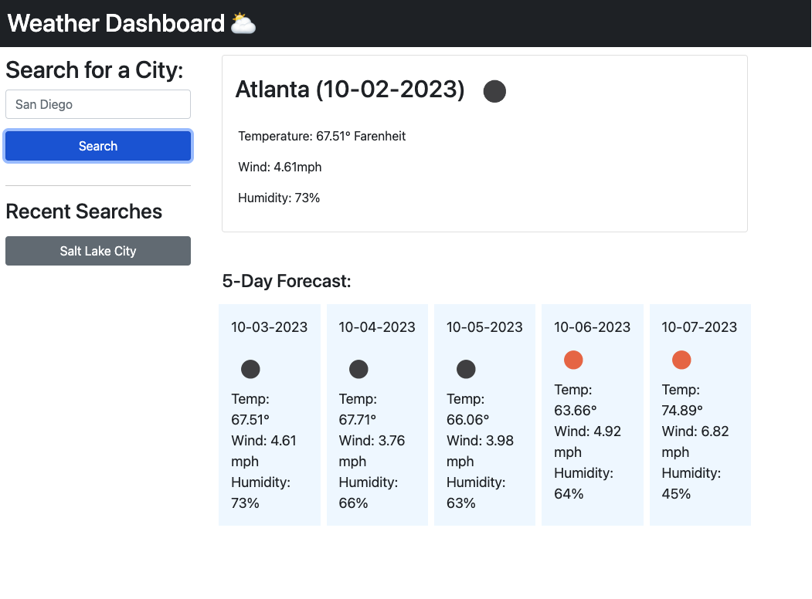

# readme-template

# Weather Dashboard

## Description

This weather dashboard uses an openWeather API to get current weather and a 5-day forecast for the city entered by the user. This app also stores the last city searched and presents it as a button for the user to easily click on. User should refresh the page to search for another city.

Link to live application: https://whitbreezy.github.io/weather-dashboard/

## Installation

Go to my repo in github and clone the code to your machine: https://github.com/whitbreezy/weather-dashboard

## Usage

Screenshot of Atlanta's weather. Salt Lake City was searched last, so it appears as a button under recent searches.

## Credits

Used my notes from class for help on this.

## License

See github repo for license info.